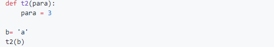
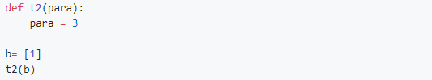
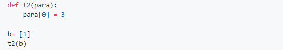

# 错题集

## Q1

有一个列表a，里面的内容分别是从0 到99999，要删除其中99998这个数字元素，下面的代码耗时最长的是

* del a\[99998\] 
* del a\[-2\] 
* a.pop\(99998\) 
* **a.remove\(99998\)**

## **Q2**

**下面的代码执行完后，变量b 的值仍然为 'a'**

**正确**

## **Q3**

**下面的代码执行完后，变量b 的值仍然为 \[1\]** 

**正确**

## **Q4**

**下面的代码执行完后，变量b 的值仍然为 \[1\]**

**错误**

