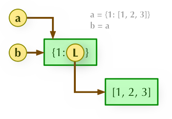

# 深拷贝&浅拷贝

## 赋值引用



## 浅拷贝（Copy）

拷贝父对象，不会拷贝对象的内部的子对象。


## 深拷贝\(Deepcopy\)

copy 模块的 deepcopy 方法，完全拷贝了父对象及其子对象。


## 例子

```python
list3 =[11,[22,33],44,55,66]
list4 = list3
print(str(list3))
list3.append(77)
print(str(list3))
print(str(list4))

# [11, [22, 33], 44, 55, 66]
# [11, [22, 33], 44, 55, 66, 77]
# [11, [22, 33], 44, 55, 66, 77]
```

## 切片：切片属于浅拷贝

```python
list3 =[11,[22,33],44,55,66]
list4 = list3[:]
print(str(list3))
list3.append(77)
print(str(list3))
print(str(list4))

[11, [22, 33], 44, 55, 66]
[11, [22, 33], 44, 55, 66, 77]
[11, [22, 33], 44, 55, 66]

```

```python
list3 =[11,[22,33],44,55,66]
list4 = list3[:]
print(str(list3))
list3[1].append(77)
print(str(list3))
print(str(list4))

[11, [22, 33], 44, 55, 66]
[11, [22, 33, 77], 44, 55, 66]
[11, [22, 33, 77], 44, 55, 66]

```

## 使用copy 浅拷贝

```text
import copy

list3 =[11,[22,33],44,55,66]
list4 = copy.copy(list3)
print(str(list3))
list3.append(77)
print(str(list3))
print(str(list4))
```

## 使用 deepcopy 深拷贝

```text
import copy

list3 =[11,[22,33],44,55,66]
list4 = copy.deepcopy(list3)
print(str(list3))
list3.append(77)
print(str(list3))
print(str(list4))
```


